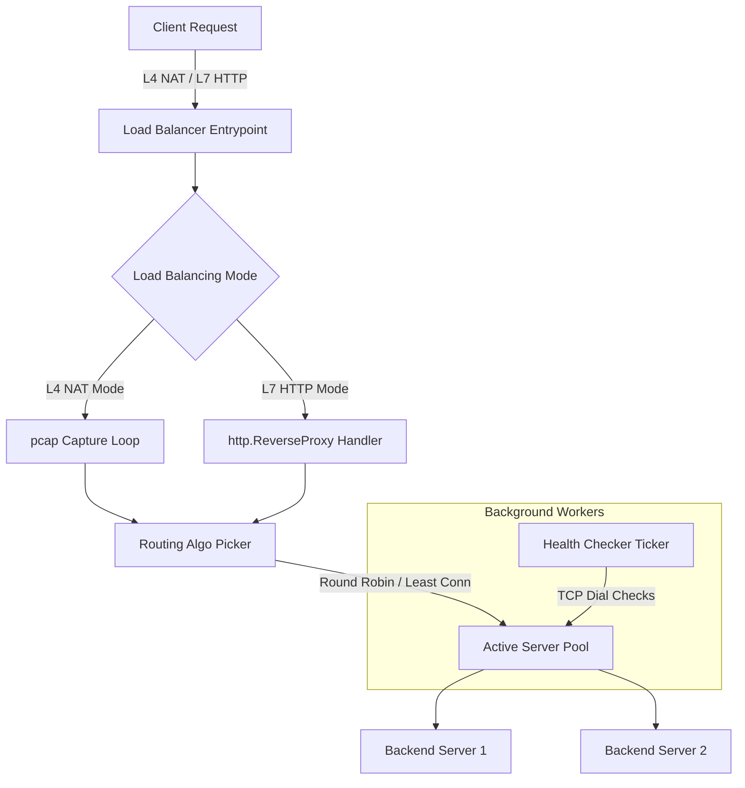

# ⚡ High-Performance Go Load Balancer (Layer 4 & Layer 7)

A modular, high-performance load balancer implemented in Go, featuring **Layer 4 NAT (Network Address Translation)** packet manipulation and **Layer 7 HTTP Reverse Proxying** with support for advanced routing algorithms, active health checking, and an interactive Cobra CLI.

---

## 🚀 Key Features

*   **Layer 4 Load Balancing (NAT Mode)**:
    *   Leverages `gopacket` and `libpcap` to intercept incoming TCP packets at the device driver/link layer.
    *   Crafts custom IP/TCP headers and calculates checksums in user space.
    *   Transmits packets using Layer 3 Raw Sockets (`AF_INET`/`SOCK_RAW`), bypassing the default kernel TCP/IP stack for packet routing.
*   **Layer 7 Load Balancing (HTTP Reverse Proxy)**:
    *   Built on top of Go's `net/http` package.
    *   Handles header manipulation, including injecting standard proxy headers (`X-Forwarded-For`, `X-Forwarded-Host`, `X-Forwarded-Proto`).
*   **Advanced Load Balancing Algorithms**:
    *   **Round Robin (`rr`)**: Distributes connections evenly across servers.
    *   **Least Connection (`lc`)**: Dynamically routes traffic to the server with the lowest active connections using an optimized min-heap structure.
*   **Active Health Checking**:
    *   An automated background checker tests backend TCP socket connectivity periodically (every 20 seconds).
    *   Dynamically registers/deregisters unhealthy servers from the active routing pool.

---

## 🛠️ Project Architecture



---

## 📋 System Requirements

*   **Operating System**: Linux (required for L4 NAT mode / raw sockets).
*   **Go Version**: Go 1.21 or newer.
*   **System Libraries**: `libpcap` development headers installed on the host.
    ```bash
    sudo apt-get install libpcap-dev
    ```
*   **Permissions**: `sudo` access is required to run the load balancer in Layer 4 mode (to capture traffic and write to raw sockets).

---

## ⚙️ Configuration (`.env`)

Create a `.env` file in the root directory of the project to set up the runtime environment:

```env
APP_PORT=:8080
DEVICE_TYPE="any"           # Use "lo" for localhost, "any" for all interfaces, or physical name e.g., "wlp0s20f3"
VIP="192.168.1.100"         # The virtual IP address targeted by clients
TRANSLATION_IP="127.0.0.2"  # Dedicated IP used for internal NAT mapping translation - can be set to any ip on your machine

---

## 🚀 Getting Started & Usage

### 1. Build the Binary
First, compile the application binary:
```bash
go build -o main
```

### 2. Prepare the Virtual Network & IP Tables
In **Layer 4 NAT Mode**, you must configure the Virtual IP (VIP) and add `iptables` rules to prevent the host OS kernel from responding with `RST` (Reset) packets to raw connections:

```bash
# Add the VIP to your network interface
sudo ip addr add VIP/32 dev DEVICE_TYPE

# Prevent kernel from intercepting client traffic to the VIP
sudo iptables -A INPUT -p tcp -d VIP --dport 80 -j DROP

# Prevent kernel from intercepting translation IP backend responses
sudo iptables -A INPUT -p tcp -d Translation-IP --dport 49152:65535 -j DROP
```

> [!TIP]
> To clean up your firewall rules after testing, you can flush the tables using:
> `sudo iptables -F INPUT`

### 3. Run the Load Balancer
Start the application via the `start` command using `sudo`:

```bash
# Start in Layer 4 (NAT) mode with Round Robin algorithm
sudo ./main start -s l4 -a rr -r 127.0.0.1:90:1 -r 127.0.0.1:100:2

# Start in Layer 7 (HTTP) mode with Least Connection algorithm
sudo ./main start -s l7 -a lc -r 192.168.1.1:90:1 -r 127.0.0.1:100:2
```

#### CLI Flag Details:
*   `-s, --mode`: The operating mode (`l4` or `l7`).
*   `-a, --algo`: Load balancing algorithm (`rr` for Round Robin, `lc` for Least Connection).
*   `-r, --server`: Target backend server formatted as `IP:PORT:WEIGHT` (can specify multiple times).

---

## 🧪 Testing

### Running Mock Backend Servers
You can spin up mock backend servers using Docker:

```bash
docker run -d -p 90:4000 -e MESSAGE="Server 1" myimage:latest
docker run -d -p 100:4000 -e MESSAGE="Server 2" myimage:latest
```

### Sending Requests
Make requests from an external machine on the same network to verify routing and algorithms:
```bash
curl http://192.168.1.100:80
```

---

## 📁 Repository Structure

*   [main.go](file:///home/subhamtech/Desktop/Go_Project/main.go): Main entry point of the application.
*   [cmd/](file:///home/subhamtech/Desktop/Go_Project/cmd): CLI commands definition using Cobra CLI.
    *   [startCmd.go](file:///home/subhamtech/Desktop/Go_Project/cmd/startCmd.go): Core server execution command setup, flag parsing, and network setup.
*   [internal/](file:///home/subhamtech/Desktop/Go_Project/internal): Internal library modules.
    *   [proxy/](file:///home/subhamtech/Desktop/Go_Project/internal/proxy): Network proxies.
        *   [l4/natMode.go](file:///home/subhamtech/Desktop/Go_Project/internal/proxy/l4/natMode.go): Core NAT mode packet capture, rewriting, and injection engine.
        *   [l4/capture.go](file:///home/subhamtech/Desktop/Go_Project/internal/proxy/l4/capture.go): Packet capture setups.
        *   [l7/L7mode.go](file:///home/subhamtech/Desktop/Go_Project/internal/proxy/l7/L7mode.go): HTTP reverse proxy implementation.
    *   [routingAlgo/](file:///home/subhamtech/Desktop/Go_Project/internal/routingAlgo): Algorithmic routing selection rules.
    *   [helper/](file:///home/subhamtech/Desktop/Go_Project/internal/helper): Supporting functions including Heap, connection mapping storage, and health checks.
